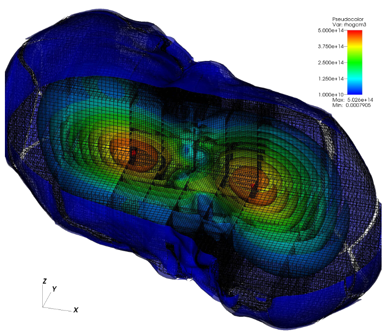

**UNDER CONSTRUCTION**



## About

[GR-Athena++](https://github.com/computationalrelativity/grathena) is a scalable code for 3+1 numerical relativity refactored from the [Athena++](https://www.athena-astro.app/index.html) magnetohydrodynamics code and adaptive mesh refinement (AMR) framework. The new main features of the code are

 * Support for [vertex-centered](https://arxiv.org/abs/2101.08289) and [cell-centered](https://arxiv.org/abs/2406.09139) spacetime variables;
 * Dynamical spacetime solver based on the [Z4c](https://arxiv.org/abs/0912.2920) formulation of 3+1 general relativity and high-order operators;
 * GRMHD solver on dynamical spacetimes based on the conservative 3+1 Eulerian "Valencia" formulation and Athena++ constrained transport algorithm;
 * Radiation transport solver on dynamical spacetimes based on the [M1 formulation](https://arxiv.org/abs/2111.14858);
 * Support for various equations of state, including tabular microphysical models;
 * Adaptive mesh refinement algorithms for black hole evolutions in the puncture framework;
 * Gravitational-wave extraction and output for Cauchy Characteristic evolution;
 * Apparent horizon finder based on [fast flow algorithm](https://arxiv.org/abs/gr-qc/9707050).

GR-Athena++ is developed by the [Computational Relativity (CoRe)](http://www.computational-relativity.org) collaboration at Jena (Germany) and Penn State (USA).

## Open source

The code is developed open source, the latest version can be retrived from the [repository](https://github.com/computationalrelativity/grathena) by typing

```
git clone https://github.com/computationalrelativity/grathena
```

## Terms of use

The code is distributed in the hope that it will be useful, but without any warranty or support. If you use the code for your research, please cite the relevant method papers listed below.

For reporting potential performance or correctness bugs in the code and algorithm, please open a detailed GitHub Issue. High quality pull requests for bugfixes or new features are accepted on a case-by-case basis. Please contact the relevant code maintainer(s) before expending too much effort on a lengthy PR.

## Method papers

 * [GR-Athena++: Puncture Evolutions on Vertex-centered Oct-tree Adaptive Mesh Refinement](https://arxiv.org/abs/2101.08289) Daszuta B., Zappa F., Cook W., Radice D., Bernuzzi S., and Morozova V. Astrophys.J.Supp. 257 (2021) 2, 25 [(bib)](https://ui.adsabs.harvard.edu/abs/2021ApJS..257...25D/exportcitation)
 * [GR-Athena++: General-relativistic magnetohydrodynamics simulations of neutron star spacetimes](https://arxiv.org/abs/2311.04989) Cook W., Daszuta B., Fields J., Hammond P., Albanesi S., Zappa F., Bernuzzi S., and Radice D. Astrophys.J.Supp. XXX (2024) XX, XXX [(bib)](https://ui.adsabs.harvard.edu/abs/2023arXiv231104989C/exportcitation)
 * [Numerical relativity simulations of compact binaries: comparison of cell- and vertex-centered adaptive meshes](https://arxiv.org/abs/2406.09139) Daszuta B., Cook W., Hammond P., Fields J., Gutiérrez E.M., Bernuzzi S., Radice D. Physical Review D, XXX [(bib)](https://ui.adsabs.harvard.edu/abs/2024arXiv240609139D/exportcitation)

## Funding

The development of GR-Athena++ was supported by the EU H2020 under ERC Starting Grant, no.~BinGraSp-714626 (PI Bernuzzi), the EU Horizon under ERC Consolidator Grant, no. InspiReM-101043372 (PI Bernuzzi), ...

